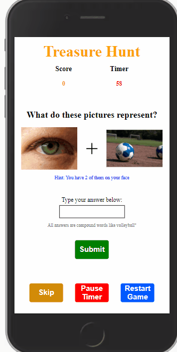
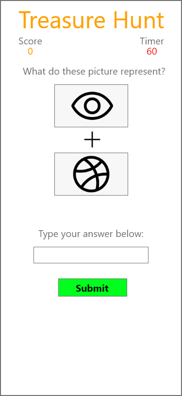

# Treasure Hunt

### Project Demo Link: [Treasure Hunt](https://smileytreasurehunt.netlify.app/)

### Table of Contents

1. Purpose
2. Motivation
3. Wireframe
4. How to play
5. Technologies Used

### Purpose:

Treasure Hunt kids web game where users use pictues to guess compound words while racing against the time.

### Motivation:

The goal was to learn Angular 11 before working on a project for the DigitalOcean App Hackathon.

### WireFrame

### How to play:

- User will input their guess and click the submit button to see if its right. 
- User can skip a problem
- User can pause the timer and un-pause
- USer can restart the game
- User is shown a hint. 

### This app was built with the following technologies:

**Angular 11:** JavaScript front-end library for building user interfaces

**Git-Hub:** Web-based version control repository and Internet hosting service

**Abode XD** A wire-framing tool used to create a mockup/visual of what is to be coded

**JavaScript:** Object-oriented programming language for web pages

**HTML:** Mark-up language for creating web pages

**CSS:** A formatting language for styling web pages

_Created by JC Smiley in December of 2020_